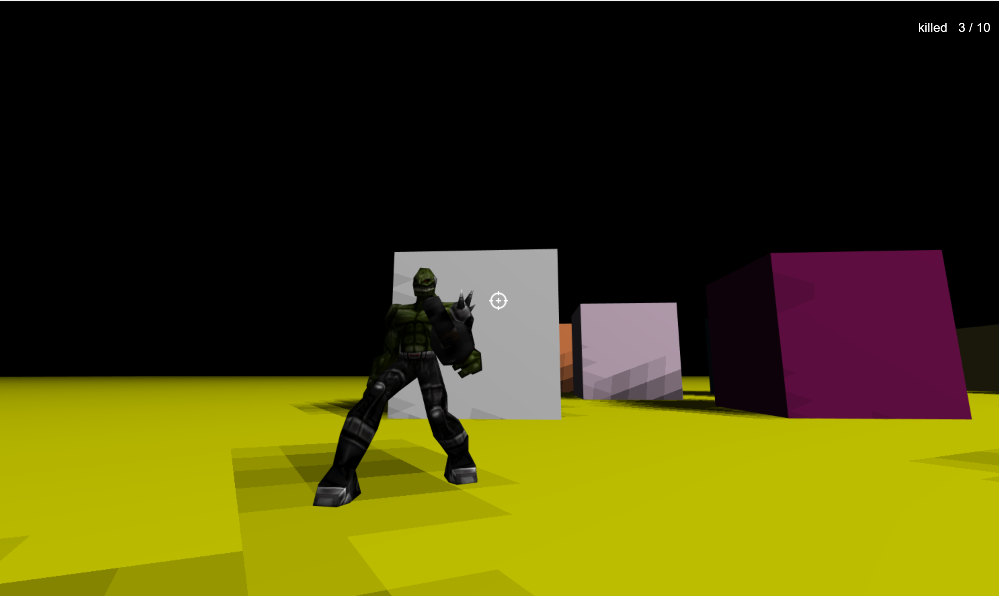

## Md2Character FPS

A simple fps game created by [three.js](https://github.com/mrdoob/three.js), [cannon.js](https://github.com/schteppe/cannon.js), and md2character model.

### Usage

Put all things in 'src' directory of project to a web root directory, when the web server is running, you can visit index.html. 

### Snapshot

